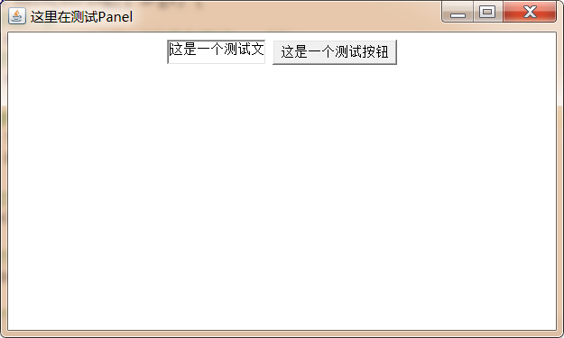
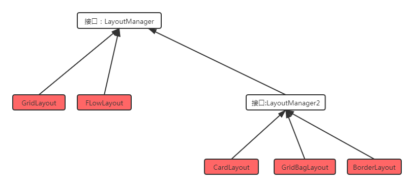

# hm-swing-awt
黑马学习java桌面端

## 一、课程简介

​		通常情况下，java语言一般是用来开发后台程序的，所谓的后台程序就是部署在服务器端的程序，默默的工作，用户是看不到任何界面的，所以很多情况下，学习java会感觉很枯燥。		

​		事实上，我们使用java语言同样可以完成图形化界面程序的开发，而学习图形化界面编程相对来说就会有趣很多，因为所见即所得，也就是说，我们写的大部分代码的执行效果，是可以通过图形化界面实实在在能够看得到的。

## 二、AWT 编程

### 2.1 AWT简介

​		AWT是 java 早期提供的抽象窗口( 何为抽象--它创建组件是调用操作系统本地的图形化工具创建对应的图形，本身不创建图像组件)工具集，它为java系统提供了基本的图形组件。所以它创建的图形的风格与操作系统的风格相同。目的是为了一次编写，处处使用。

### 2.2 AWT继承体系

​		所有的 AWT 编程相关的类都放在 java.awt 包以及它的子包中，AWT 编程中有两个基类和组件管理接口(主要用于布局)：Component(常见组件)、MenuComponent(菜单组件)、LayOutManager(组件布局接口)

- Component：代表一个能以图形化方式显示出来的组件，并且可以与用户交互的组件，比如Button(按钮)：TextField(文本框)等
- MenuComponent：代表图像界面的菜单组件，例如，MenuBar(菜单条)、MneuItem(菜单项)等
- LayoutManager：控制组件的布局的接口

LayoutManager的继承体系如下图

### 2.3 Container 容器

 		容器是特殊的组件

#### 2.3.1 Container 容器的继承体系

**容器的默认布局管理器：**

- Window容器是可以单独存在的顶级窗口，默认使用的是BorderLayout布局管理器
- Panel容器可以容纳其他组件，但是不能单独存在，默认使用的是 FlowLayout布局管理器
- ScrollPanel是一个带滚动条的容器，它也不能单独存在，默认使用的BorderLayout 布局管理器

#### 2.3.2 常见的APPI

​		Component作为基类，提供了如下常用的方法来设置大小、坐标、可见性。

| 方法功能             | 方法签名                                    |
| :------------------- | :------------------------------------------ |
| 设置组件的位置       | setLocation(int x,int y)                    |
| 设置组件的大小       | setSize(int width,int height)               |
| 设置组件的位置和大小 | setBounds(int x,int y,int width,int height) |
| 设置组件的可见性     | setVisible(Boolean b)                       |

​	Container 作为容器根类，提供了如下方法来访问容器中的组件

| 方法功能                                      | 方法签名                                                     |
| --------------------------------------------- | ------------------------------------------------------------ |
| Component add(Component comp)                 | 向容器中添加其他组件(该组件既可以是普通组件，也可以是容器)，并返回被添加的组件。 |
| Component getComponent(Component int x,int y) | 根据坐标获取对应的组件                                       |
| int getComponentCount()                       | 获取当前容器下有多少个组件                                   |
| Component[] getComponents()                   | 返回该容器内所有组件                                         |

#### 2.3.3 容器的演示

##### 2.3.3.1 window

~~~java
public class FrameDemo {
    public static void main(String[] args) {
        //创建一个窗口对象

        Frame frame = new Frame("测试窗口");

        //设置窗口大小和位置

        frame.setLocation(100,100);
        frame.setSize(400,300);

        //设置窗口可见

        frame.setVisible(true);
    }
}
~~~

##### 2.3.3.2 panel

~~~java

public class PanelDemo {
    public static void main(String[] args) {
        //创建一个窗口，用于存放Panel,panel不能单独存在
        Frame frame = new Frame("这里演示Panel容器");
        
        //创建一个panel，用于存放文本狂和按钮
        Panel panel = new Panel();
        
        //创建一个文本框和按钮，并存放到panel中
        panel.add(new TextField("这里是文本域测试"));
        panel.add(new Button("这是一个测试按钮"));
        
        //把panel存放到window中
        frame.add(panel);
        
        //设置window的大小和位置
        frame.setBounds(100,200,500,300);
        
        //设置window的可见性
        frame.setVisible(true);
    }
}

~~~

##### 2.3.3 ScrollPanel

~~~java

public class ScrollPanelDemo {
    public static void main(String[] args) {

        //创建一个窗口，用于存放Panel,panel不能单独存在
        Frame frame = new Frame("这里演示ScrollPanel容器");

        //创建一个panel，用于存放文本狂和按钮
        ScrollPane panel = new ScrollPane(ScrollPane.SCROLLBARS_ALWAYS);

        //创建一个文本框和按钮，并存放到panel中
        panel.add(new TextField("这里是文本域测试"));
        panel.add(new Button("这是一个测试按钮"));

        //把panel存放到window中
        frame.add(panel);

        //设置window的大小和位置
        frame.setBounds(100,200,500,300);

        //设置window的可见性
        frame.setVisible(true);
    }
}

~~~

​		这里存在一个问题，这里只显示了按钮button，没有显示文本框text，这个是布局管理器导致的，我们后面学习解决这个问题。

### 2.4 LayoutManager 布局管理器

​		如果我们使用set方法来设置组件的大小，那么大小就固定了，那么在不同的系统中显示出来的效果就不一样了。就与 Java 一处编码处处使用的理念相悖了。	

~~~java
Label label = new Label("你好，世界");
~~~

​	例如上面的代码为使文字与组件之间 "完美的显示(最佳大小)"，各个操作系统的像素不一样。所以不能直接使用set方法设置像素大小的方式。Java提供的解决方案是使用布局管理器。

**常用布局管理器的继承体系**

#### 2.4.1 FlowLayout 流式布局布局管理器

​		组件像流水一样，向某个方向流动(排列)，遇到障碍(边界)就折回，重头开始排列。在默认的情况下，Flowlayout 布局布局管理器默认从左向右排列所有的组件。

**FlowLayout的主要API**

| 构造方法                                 | 方法功能                                                     |
| ---------------------------------------- | ------------------------------------------------------------ |
| FloatLayout                              | 使用默认的对其方式，以及默认的垂直间距、水平间距创建FlowLayout布局管理器 |
| FloatLayout(int align)                   | 使用指定的对其方式，以及默认的垂直间距、水平间距创建FlowLayout布局管理器 |
| FloatLayout(int align,int hgap,int vgap) | 使用默认的对其方式、垂直间距、水平间距创建FlowLayout布局管理器 |

FlowLayout 中组件的排列方向(从左向右、从右向左、从中间向两边等) ， 该参数应该使用FlowLayout类的静态常量 : FlowLayout. LEFT 、 FlowLayout. CENTER 、 FlowLayout. RIGHT ，默认是左对齐。

FlowLayout 中组件中间距通过整数设置，单位是像素，默认是5个像素。

~~~java
public class FlowLayoutDemo {
    public static void main(String[] args) {
        Frame frame = new Frame("这里测试FlowLayout");

        //修改Frame的默认布局方式
//        frame.setLayout(new FlowLayout(FlowLayout.LEFT,20,20));
        frame.setLayout(new FlowLayout(FlowLayout.RIGHT,20,20));

        //添加按钮 Button组件
        for (int i = 0; i < 100; i++) {
            frame.add(new Button("按钮" + i));
        }

        frame.pack();

        frame.setVisible(true);
    }
}
~~~

#### 2.4.2 BorderLayout 边框布局器

​			BorderLayout 边框布局管理器将容器分为 EAST(东) 、 SOUTH (南)、 WEST (西)、 NORTH(北) 、 CENTER(中)五个区域，普通组件可以被放置在这 5 个区域的任意一个中 。 BorderLayout布局 管理器的布局示意图如图所示 。

​		当改变使用BorderLayout布局管理器的容器大小时，NORTH、SOUTH和CENTER改变水平方向的大小，WEST、EAST和CENTER改变垂直方向的大小。使用边框布局管理器的时候注意以下两点：

1. 向同一个区域添加多个组件的时候，最后一个会覆盖前面的
2. 使用BorderLayout添加组件的时候，需要指定区域，默认是放在CENTER区域

**常见的API**

| 构造方法                        | 方法功能                                               |
| ------------------------------- | ------------------------------------------------------ |
| BorderLayout()                  | 使用默认的水平间距和垂直间距创建BorderLayout布局管理器 |
| BorderLayout(int hgap,int vgap) | 使用指定的水平间距和垂直间距创建BorderLayout布局管理器 |

~~~java
public class BorderLayoutDemo {
    public static void main(String[] args) {
        Frame frame = new Frame("这里是一个BorderLayout");

        //frame设置Border布局管理器
        frame.setLayout(new BorderLayout(30, 10));
        //指定地区添加组件
        frame.add(new Button("东侧按钮"),BorderLayout.EAST);
        frame.add(new Button("南侧按钮"),BorderLayout.SOUTH);
        frame.add(new Button("西侧按钮"),BorderLayout.WEST);
        frame.add(new Button("北侧按钮"),BorderLayout.NORTH);
        frame.add(new Button("中心按钮"),BorderLayout.CENTER);

        frame.pack();
        frame.setVisible(true);
    }
}
~~~

~~~java
public class BorderLayoutDemo2 {
    public static void main(String[] args) {
        Frame frame = new Frame("这里是一个BorderLayout");

        //frame设置Border布局管理器
//        frame.setLayout(new BorderLayout(30, 10));
        //指定地区添加组件
//        frame.add(new Button("东侧按钮"),BorderLayout.EAST);
        frame.add(new Button("南侧按钮"),BorderLayout.SOUTH);
//        frame.add(new Button("西侧按钮"),BorderLayout.WEST);
        frame.add(new Button("北侧按钮"),BorderLayout.NORTH);
//        frame.add(new Button("中心按钮"),BorderLayout.CENTER);
        Panel panel = new Panel();
        panel.add(new Button("中间按钮"));
        panel.add(new TextField("测试文本框"));
        frame.add(panel,BorderLayout.CENTER);
        frame.pack();
        frame.setVisible(true);
    }
}
~~~

#### 2.4.3 GridLaoyout 网格布局管理器

​		gridLayout是网格布局管理器，它是将组件的容器按照横线和竖线分割成网格状，然后组件默认按照从左到右，从上到下的排列顺序依次放组件到使用GridLayout布局管理器的容器中。

**常用的API**

| 构造函数                                        | 方法功能                                                     |
| ----------------------------------------------- | ------------------------------------------------------------ |
| GridLayout(int rows,int cols)                   | 采用指定的行数和列数，使用默认的横向间距和竖向间距创建布局管理器 |
| GridLayout(int rows,int cols,int hgap,int vgap) | 采用指定的行数和列数,以及横向间距和竖向间距创建布局管理器    |

**计算器案例**

~~~java
public class GridLayoutDemo {
    public static void main(String[] args) {
        Frame frame = new Frame("计算器");

        Panel panel1 = new Panel();
        panel1.add(new TextField(30));

        frame.add(panel1,BorderLayout.NORTH);

        GridLayout gridLayout = new GridLayout(3, 5, 4, 4);
        Panel panel2 = new Panel(gridLayout);

        for (int i = 0; i < gridLayout.getColumns()*gridLayout.getColumns(); i++) {
            if(i < 10){
                panel2.add(new Button("" + i));
            }else if(i == 10){
                panel2.add(new Button("+" ));
            }else if(i == 11){
                panel2.add(new Button("-" ));
            }else if(i == 12){
                panel2.add(new Button("*" ));
            }else if(i == 13){
                panel2.add(new Button("/" ));
            }else if(i == 14){
                panel2.add(new Button("." ));
            }
        }

        frame.add(panel2,BorderLayout.CENTER);

        frame.pack();
        frame.setVisible(true);
    }
}
~~~

#### 2.3.4 GridBagLayout 网格包布局管理器

​		在GridBagLayout布局管理器中，组件可以跨越一个或者多个网格，并设置每一个的网格大小不同，从而增加布局的灵活性。当窗口发生改变的时候，GridBagLayout布局管理器也可以准确地控制窗口各部分的拉伸。

​		每个组件可以占用多个网格，此时，我们往容器中添加组件的时候，就需要具体的控制每个组件占用多少个网格，java提供的GridBagConstaints类，与特定的组件绑定，可以完成具体大小和跨越性的设置。

| 成员变量   | 含义                                                         |
| ---------- | ------------------------------------------------------------ |
| gridx      | 设置受该对象控制的GUI组件左上角所在网格的横向索引            |
| gridy      | 设置受该对象控制的GUI组件左上角所在网格的纵向索引            |
| gridwidth  | 设置受该对象控制的 GUI 组件横向跨越多少个网格,如果属性值为 GridBagContraints.REMAIND,则表明当前组件是横向最后一个组件，如果属性值为GridBagConstraints.RELATIVE,表明当前组件是横向倒数第二个组件。 |
| gridheight | 设置受该对象控制的 GUI 组件纵向跨越多少个网格，如果属性值为 GridBagContraints.REMAIND,则表明当前组件是纵向最后一个组件，如果属性值为GridBagConstraints.RELATIVE,表明当前组件是纵向倒数第二个组件。 |
| fill       | 当"显示区域"大于"组件"的时候,如何调整组件 ：  GridBagConstraints.NONE : GUI 组件不扩大  GridBagConstraints.HORIZONTAL: GUI 组件水平扩大 以 占据空白区域  GridBagConstraints.VERTICAL: GUI 组件垂直扩大以占据空白区域  GridBagConstraints.BOTH: GUI 组件水平 、 垂直同时扩大以占据空白区域. |
| ipadx      | 设置受该对象控制的 GUI 组件横向内部填充的大小，即 在该组件最小尺寸的基础上还需要增大多少. |
| ipady      | 设置受该对象控制的 GUI 组件纵向内部填充的大小，即 在该组件最小尺寸的基础上还需要增大多少. |
| insets     | 设置受该对象控制 的 GUI 组件的 外部填充的大小 ， 即该组件边界和显示区 域边界之间的 距离 . |
| weightx    | 设置受该对象控制 的 GUI 组件占据多余空间的水平比例， 假设某个容器 的水平线上包括三个 GUI 组件， 它们的水平增加比例分别是 1 、 2 、 3 ， 但容器宽度增加 60 像素 时，则第一个组件宽度增加 10 像素 ， 第二个组件宽度增加 20 像素，第三个组件宽度增加 30 像 素。 如 果其增 加比例为 0 ， 则 表示不会增加 。 |
| weighty    | 设置受该对象控制 的 GUI 组件占据多余空间的垂直比例           |
| anchor     | 设置受该对象控制 的 GUI 组件在其显示区域中的定位方式: GridBagConstraints .CENTER (中 间 ) GridBagConstraints.NORTH (上中 )  GridBagConstraints.NORTHWEST (左上角) GridBagConstraints.NORTHEAST (右上角) GridBagConstraints.SOUTH (下中)  GridBagConstraints.SOUTHEAST (右下角) GridBagConstraints.SOUTHWEST (左下角) GridBagConstraints.EAST (右中)  GridBagConstraints.WEST (左中) |

以后在SWing中有更强大的，所以可以后面学习。

#### 2.3.5 CardLayout卡片布局器

​		像扑克牌一样，将所有的组件累起来，只有最上面的一个组件是可见，要显示哪个组件，就将哪个组件放在最上面。

**最主要的API**

| 方法名称                           | 方法功能                                                     |
| ---------------------------------- | ------------------------------------------------------------ |
| CardLayout()                       | 创建默认的卡片布局器                                         |
| CardLayout(int hgap,int vgap)      | 通过指定卡片的左右上下边距(距离左右上下边界)，来创建卡片布局器 |
| first(Container target)            | 显示容器中第一个组件                                         |
| last(Container target)             | 显示容器中最后一个组件                                       |
| previous(Container target)         | 显示容器中上一个组件                                         |
| next(Container target)             | 显示容器中下一个组件                                         |
| show(Container target,String name) | 显 示 target 容器中指定名字的卡片.                           |

~~~java

public class CardLayoutDemo {
    public static void main(String[] args) {
        Frame frame = new Frame("卡片布局管理器");

        //1、创建一个Panel容器
        Panel cardPanel = new Panel();

        //2、创建一个CardLayout对象，放到上一个容器中
        CardLayout cardLayout = new CardLayout();
        cardPanel.setLayout(cardLayout);

        //3、向Panel容器中放入多个组件
        String[] names = {"第一张", "第二张", "第三张", "第四张", "第五张"};
        for (int i = 0; i < names.length; i++) {
            cardPanel.add(names[i], new Button(names[i]));
        }

        //4、把panel放到窗口frame中
        frame.add(cardPanel, BorderLayout.CENTER);

        //5、创建另外一个panel，用于存放多个按钮组件
        Panel buttonPanel = new Panel();
        //6、创建五个按钮
        Button button1 = new Button("第一张");
        Button button2 = new Button("最后一张");
        Button button3 = new Button("上一张");
        Button button4 = new Button("下一张");
        Button button5 = new Button("第三张");

        //7、创建一个事件监听器，监听按钮的点击动作
        ActionListener listener = event -> {
            String command = event.getActionCommand();
            switch (command) {
                case "第一张":
                    cardLayout.first(cardPanel);
                    break;
                case "最后一张":
                    cardLayout.last(cardPanel);
                    break;
                case "上一张":
                    cardLayout.previous(cardPanel);
                    break;
                case "下一张":
                    cardLayout.next(cardPanel);
                    break;
                case "第三张":
                    cardLayout.show(cardPanel, "第三张");
                    break;
            }
        };

        //8、把当前这个时间监听器和多个按钮放到一起
        button1.addActionListener(listener);
        button2.addActionListener(listener);
        button3.addActionListener(listener);
        button4.addActionListener(listener);
        button5.addActionListener(listener);

        //9、把按钮添加到第二个容器panel中
        buttonPanel.add(button1);
        buttonPanel.add(button2);
        buttonPanel.add(button3);
        buttonPanel.add(button4);
        buttonPanel.add(button5);

        //10、把第二个容器放到窗体frame中
        frame.add(buttonPanel,BorderLayout.SOUTH);

        frame.pack();
        frame.setVisible(true);
    }
}
~~~

#### 2.3.6 BoxLayout 盒子布局管理器

​			BoxLayout 盒子布局管理器是由Swing创建的一个布局管理器，它可以在垂直和水平方向上摆放组件。

**主要的构造方法**

| 构造方法                              | 方法作用                                                     |
| ------------------------------------- | ------------------------------------------------------------ |
| BoxLayout(Container target, int axis) | 指定创建基于 target 容器的 BoxLayout 布局管理器，该布局管理器里的组件按 axis 方向排列。其中 axis 有 BoxLayout.X_AXIS( 横向)和 BoxLayout.Y _AXIS (纵向〉两个方向。 |

~~~java
public class BoxLayoutDemo {
    public static void main(String[] args) {
        Frame frame = new Frame("测试BoxLayout");

//        BoxLayout boxLayout = new BoxLayout(frame, BoxLayout.Y_AXIS);
        BoxLayout boxLayout = new BoxLayout(frame, BoxLayout.X_AXIS);

        frame.add(new Button("按钮1!"));
        frame.add(new Button("按钮2!"));
        frame.setLayout(boxLayout);

        frame.pack();
        frame.setVisible(true);
    }
}
~~~

​		在java.swing包中，提供了一个新的容器Box，该容器的默认布局管理器就是 BoxLayout，大多数情况下，使用Box容器去容纳多个GUI组件，然后再把Box容器作为一个组件，添加到其他的容器中，从而形成整体窗口布局。

| 方法名称                         | 方法功能                        |
| -------------------------------- | ------------------------------- |
| static Box createHorizontalBox() | 创建一个水平排列组件的Box容器。 |
| static Box createVerticalBox()   | 创建一个垂直排列组件的Box容器。 |

~~~java
public class BoxLayoutDemo3 {
    public static void main(String[] args) {
        Frame frame = new Frame("测试BoxLayout2");
        //水平容器
        Box boxHoriz = Box.createHorizontalBox();
        boxHoriz.add(new Button("水平按钮1"));
        boxHoriz.add(new Button("水平按钮2"));

        //垂直容器
        Box boxVert = Box.createVerticalBox();
        boxVert.add(new Button("垂直按钮1"));
        boxVert.add(new Button("垂直按钮2"));

        frame.add(boxHoriz,BorderLayout.NORTH);
        frame.add(boxVert);
        frame.pack();
        frame.setVisible(true);
    }
}

~~~

​		如上图所见，box和box中的组件之间是没有间隔的，不是很美观，如何使用BoxLayout设置间距呢？

​		我们只需要在原有的组件需要间隔的地方，添加间隔即可，而每个间隔可以是一个组件，只不过该组件没有内容，仅仅起到一种分隔的作用。

**Box类中，提供了5个方便的静态方法来生成这些间隔组件：**

| 方法名称                                          | 方法功能                                         |
| ------------------------------------------------- | ------------------------------------------------ |
| static Component createHorizontalGlue()           | 创建一个水平分割(可以在两个方向上同时拉伸的间距) |
| static Component createVerticalGlue()             | 创建一个垂直分割(可以在两个方向上同时拉伸的间距) |
| static Component createHorizontalStrut(int width) | 创建一个水平分割(长度固定，不会随着拉伸改变大小) |
| static Component createVerticalGlue(int height)   | 创建一个垂直分割(宽度固定，不会随着拉伸改变大小) |

~~~java
public class BoxLayoutDemo4 {
    public static void main(String[] args) {
        Frame frame = new Frame("测试BoxLayout2");

        Box hBox = Box.createHorizontalBox();
        hBox.add(new Button("水平按钮1"));
        hBox.add(Box.createHorizontalGlue());
        hBox.add(new Button("水平按钮2"));
        hBox.add(Box.createHorizontalStrut(5));
        hBox.add(new Button("水平按钮3"));

        Box vBox = Box.createVerticalBox();
        vBox.add(Box.createVerticalGlue());
        vBox.add(new Button("垂直按钮1"));
        vBox.add(Box.createVerticalGlue());
        vBox.add(new Button("垂直按钮2"));
        vBox.add(Box.createVerticalStrut(5));
        vBox.add(new Button("垂直按钮3"));

        frame.add(hBox,BorderLayout.NORTH);
        frame.add(vBox);

        frame.pack();
        frame.setVisible(true);
    }
}

~~~

​	 		

### 2.5 AWT中常用的组件

#### 2.5.1 基本组件

